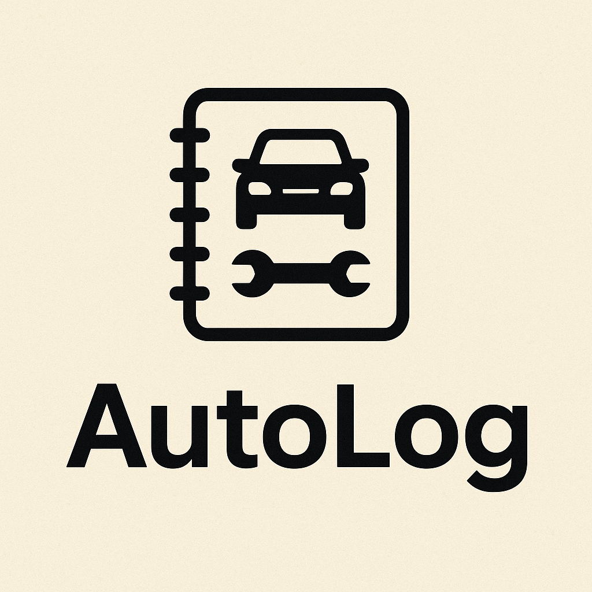
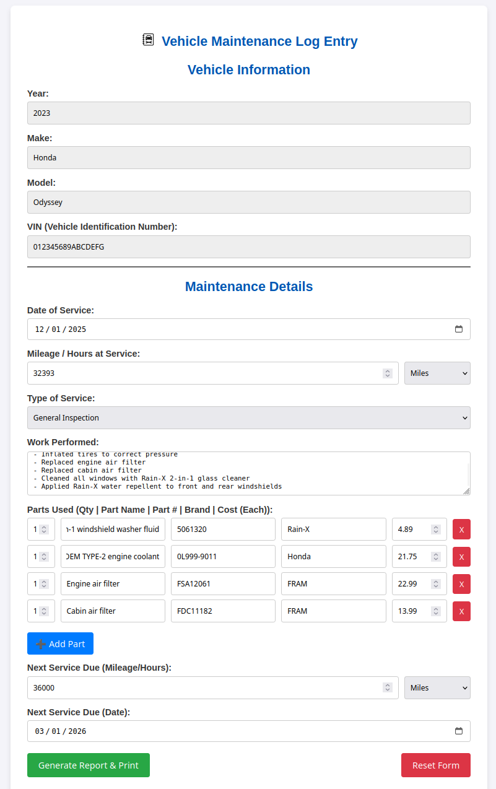
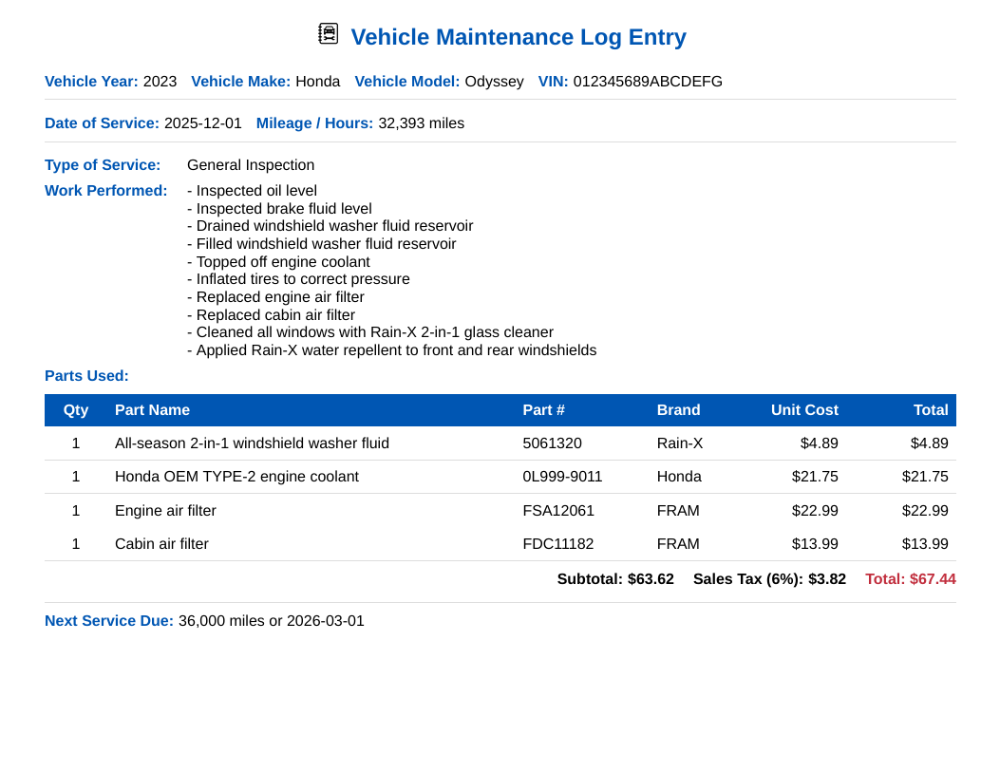

# AutoLog



AutoLog helps you create clean-looking records for tracking DIY vehicle
maintenance. Records can be saved as PDF files or printed and stored in a
physical logbook.

## How to

To use AutoLog, configure any web server to serve the `maintenance.html` file and
associated directories. A quick and dirty way to get up and running is to use
Python's built-in web server.

```bash
$ python -m http.server
```

Then use your browser to access your server. The year, make, model, and VIN are
passed as query parameters in the URL.

__Example:__
http://localhost:8000/maintenance.html/?year=2023&make=Honda&model=Odyssey&vin=012345689ABCDEFG




Fill in the form click "Generate Report & Print". 


