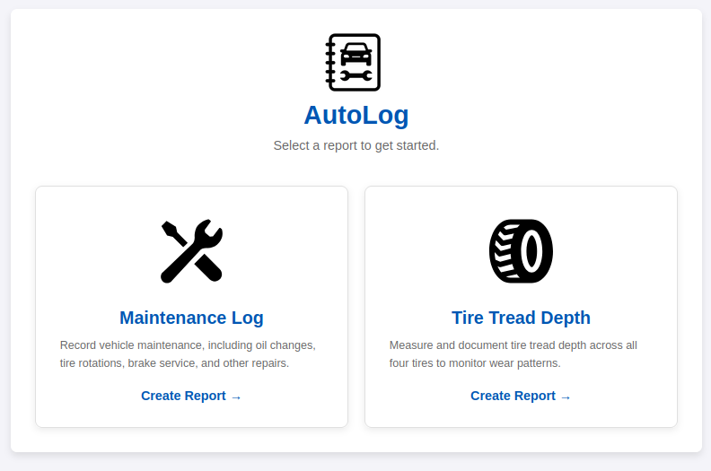
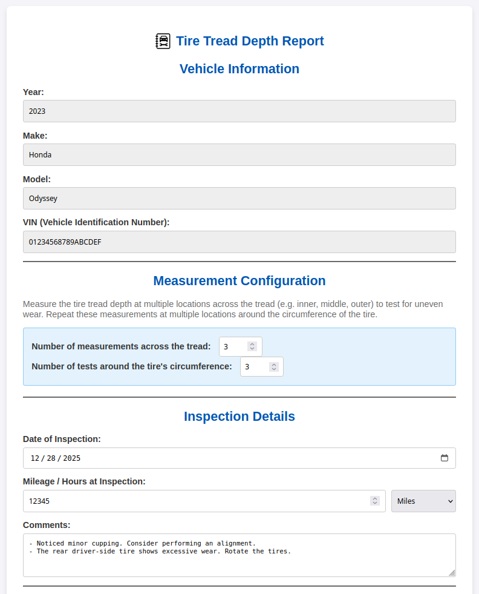
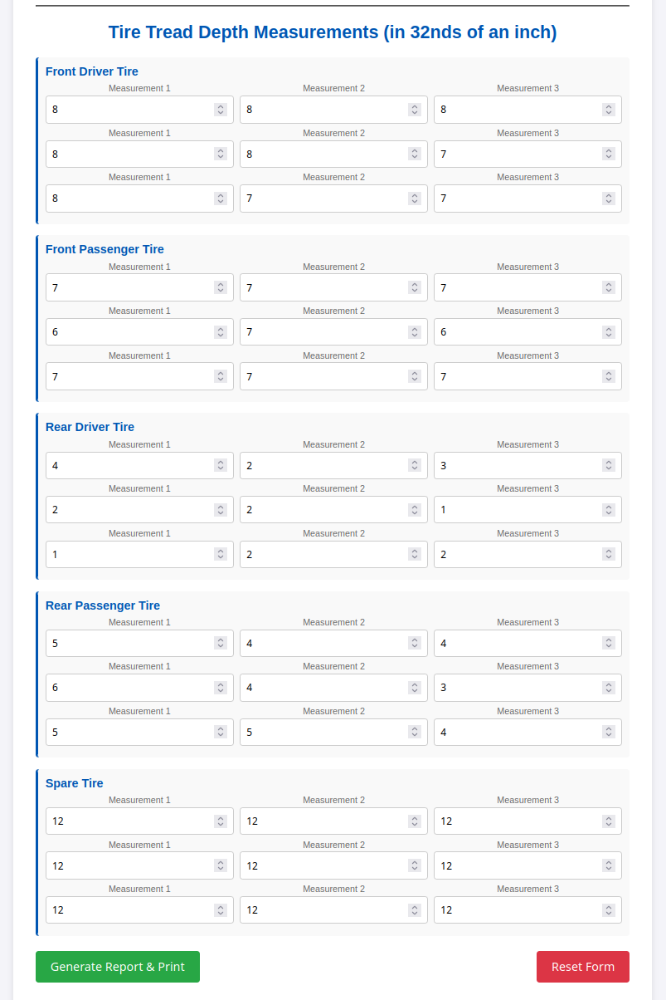
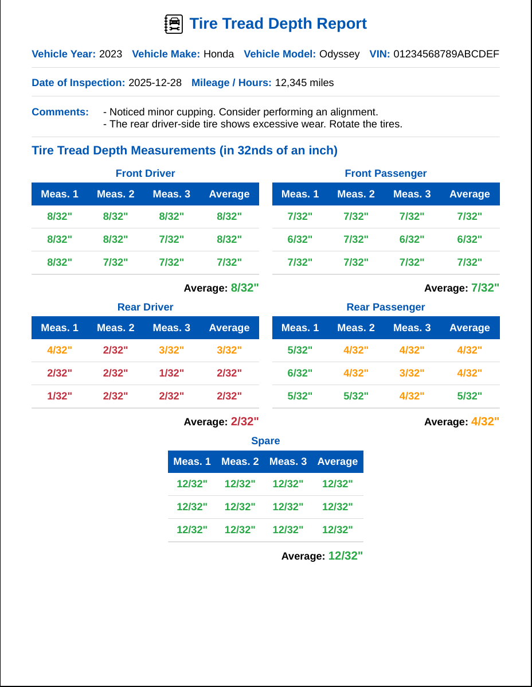

# AutoLog


AutoLog helps you create clean-looking records for tracking DIY vehicle
maintenance. Records can be saved as PDF files or printed and stored in a
physical logbook.

## How to
### Starting AutoLog

To use AutoLog, configure any web server to serve the `index.html` file and
associated directories. A quick and dirty way to get up and running is to use
Python's built-in web server.

```bash
$ python -m http.server
```

Then use your browser to access your server. The year, make, model, and VIN are
passed as query parameters in the URL.

__Example:__
http://localhost:8000/maintenance.html/?year=2023&make=Honda&model=Odyssey&vin=012345689ABCDEFG



### Creating a maintenance log report

Choose "Maintenance Log" on the landing page. Fill in the form with the details
of the maintenance that was performed.


Click "Generate Report & Print". Your browser will display the "print" dialog
so that the report can be printed. The printed report will look similar to the
one shown below.


### Creating a tire tread depth report

Choose "Tire Tread Depth" on the landing page.



Specify the number of measurements you'll take across the tread. Then specify
the number of times this will be done around the tire's circumference. The form
will automatically be updated with the requisite number of fields.

Fill in the form with the measurements taken from the tires, odometer reading,
date, and any comments you'd like to include with the report.



Click "Generate Report & Print". Your browser will display the "print" dialog so that the
report can be printed. The printed report will look similar to the one shown
below.


